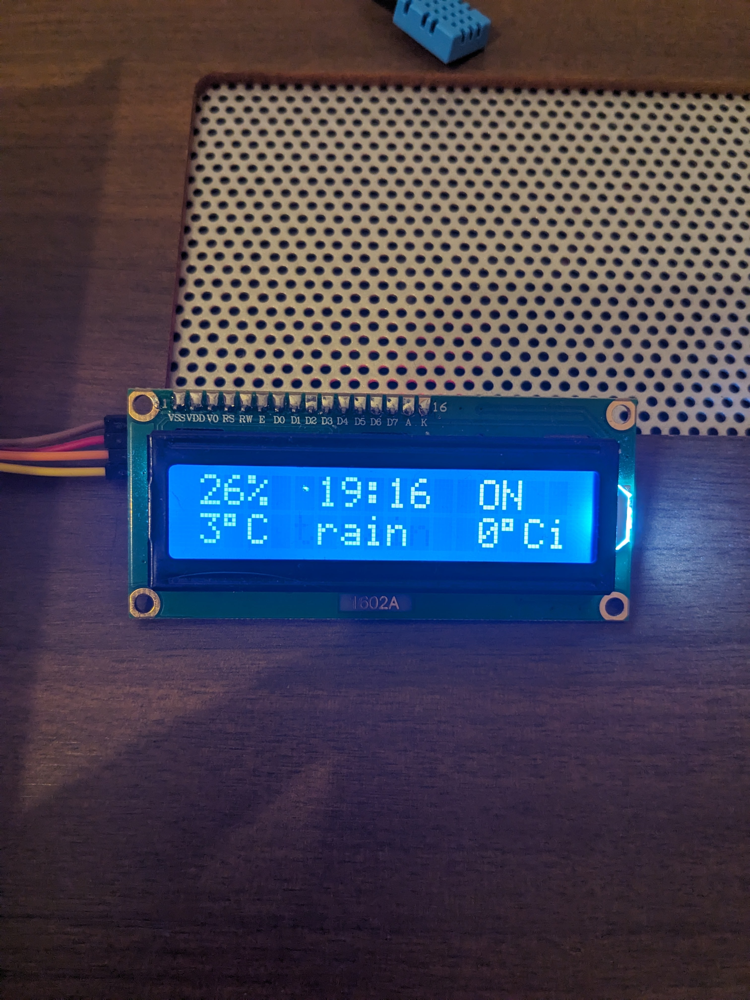

# Raspberry Pi LCD I2C Display Service

This project displays weather information, indoor temperature and humidity, current time, and server status on an I2C-connected LCD display using Raspberry Pi.

## Features

- **Weather Display**: Shows live weather data using an external weather API.
- **Indoor Temperature and Humidity**: Real-time monitoring using a DHT11 temperature and humidity sensor.
- **Clock**: Current date and time.
- **Server Status Checker**: Live monitoring of specified server statuses.

## Requirements

- Raspberry Pi
- LCD Display (I2C interface)
- Python 3
- Adafruit DHT sensor library
- API key from a weather service (e.g., OpenWeatherMap)
- DHT11 Temperature and Humidity Sensor

## Installation

### Step 1: Enable I2C Interface

1. Run `sudo raspi-config`
2. Navigate to `Interface Options` → `I2C` → Enable
3. Reboot the Raspberry Pi

### Step 2: Install Dependencies

```bash
sudo apt update
sudo apt install git python3-pip
pip install Adafruit_DHT requests --break-system-packages
```

### Step 3: Setup LCD Driver

```bash
cd /home/${USER}/
git clone https://github.com/the-raspberry-pi-guy/lcd.git
cd lcd/
sudo ./install.sh
```

### Step 4: Connect I2C LCD Display

Connect your I2C LCD display to Raspberry Pi GPIO pins:

| LCD Pin  | Raspberry Pi GPIO Pin |
|----------|-----------------------|
| VCC      | 5V                    |
| GND      | GND                   |
| SDA      | GPIO2 (Pin 3)         |
| SCL      | GPIO3 (Pin 5)         |

### Step 5: Connect DHT11 Sensor

Connect your DHT11 sensor to Raspberry Pi GPIO pins:

| DHT11 Pin | Raspberry Pi GPIO Pin |
|-----------|-----------------------|
| VCC       | 3.3V                  |
| GND       | GND                   |
| Data      | GPIO4 (Pin 7)         |

### Step 6: Deploy the Display Script and Service

- Paste `display.py` into the `lcd` folder.
- Obtain an API key from a weather service provider and update it in `display.py`.
- Verify the GPIO pin configuration in `display.py` (default is GPIO4 for DHT11).
- Copy the provided service file (`display.service`) into the system services folder:

```bash
sudo cp display.service /lib/systemd/system/
```

### Step 7: Enable and Start the Service

```bash
sudo systemctl daemon-reload
sudo systemctl enable display.service
sudo systemctl start display.service
```

## Configuration

Edit `display.py` to adjust monitored servers, weather API keys, location settings, sensor GPIO pin, and other configurations as required.



## Contribution

Contributions and suggestions are welcome. Fork the repository and open a pull request.

## License

This project is licensed under the MIT License.
